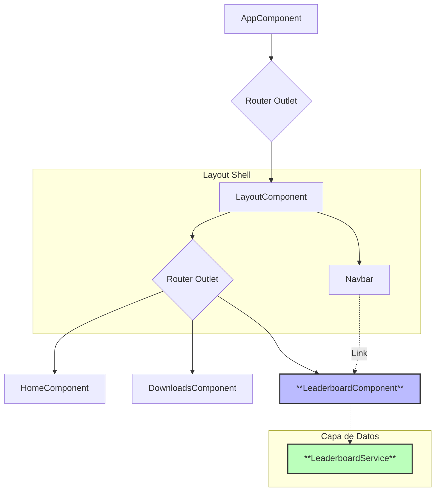
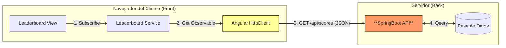
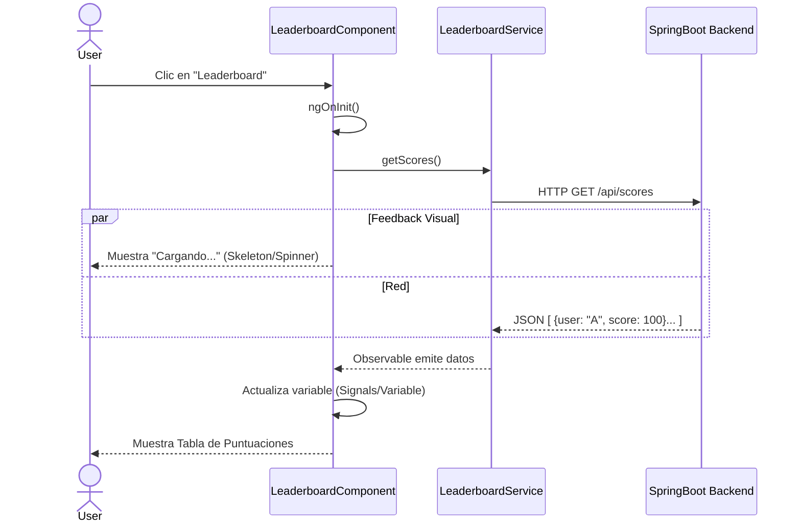

# Diagrama de Árbol de Componentes

```mermaid
graph TD
    App[AppComponent] --> Router{Router Outlet}
    Router --> Layout[LayoutComponent]
    
    subgraph "Layout Shell"
        Layout --> Nav[Navbar]
        Layout --> Content{Router Outlet}
    end
    
    Content --> Home[HomeComponent]
    Content --> Downloads[DownloadsComponent]
    Content --> Lead[**LeaderboardComponent**]
    
    subgraph "Capa de Datos"
        Service[**LeaderboardService**]
    end
    
    Lead -.-> Service
    Nav -.-> |Link| Lead
    
    style Lead fill:#bbf,stroke:#333,stroke-width:2px
    style Service fill:#bfb,stroke:#333,stroke-width:2px
```
# Diagrama de Arquitectura de Sistema

```mermaid
graph LR
    subgraph "Navegador del Cliente (Front)"
        UI[Leaderboard View]
        LService[Leaderboard Service]
        Http[Angular HttpClient]
    end
    
    subgraph "Servidor (Back)"
        API[**SpringBoot API**]
        DB[(Base de Datos)]
    end
    
    UI -->|1. Subscribe| LService
    LService -->|2. Get Observable| Http
    Http == "3. GET /api/scores (JSON)" ==> API
    API <-->|4. Query| DB
    
    style API fill:#f96,stroke:#333
    style Http fill:#ff9,stroke:#333
```
# Diagrama de Secuencia

```mermaid
sequenceDiagram
    actor User
    participant Page as LeaderboardComponent
    participant Service as LeaderboardService
    participant API as SpringBoot Backend

    User->>Page: Clic en "Leaderboard"
    Page->>Page: ngOnInit()
    Page->>Service: getScores()
    Service->>API: HTTP GET /api/scores
    
    par Feedback Visual
        Page-->>User: Muestra "Cargando..." (Skeleton/Spinner)
    and Red
        API-->>Service: JSON [ {user: "A", score: 100}... ]
    end
    
    Service-->>Page: Observable emite datos
    Page->>Page: Actualiza variable (Signals/Variable)
    Page-->>User: Muestra Tabla de Puntuaciones
```
